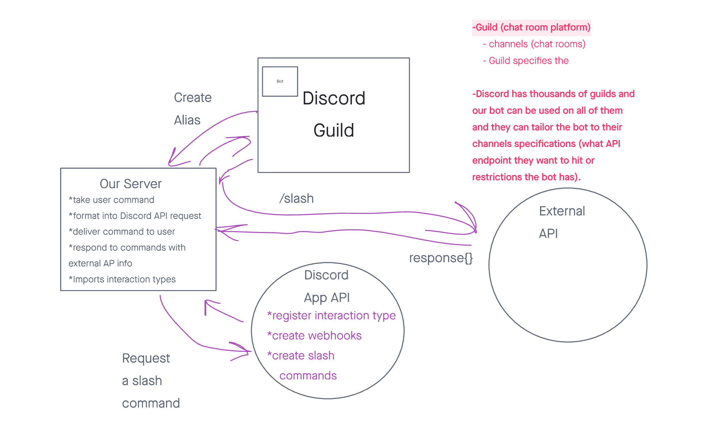

# api-utility-bot

## Utlity-bot

#### Micha, Michael Tiara

**Descriptio**: 
A chat bot that can create aliases for API requests and tie them to in-chat slash commands.

[Our team repo](https://github.com/Back-End-Masters/api-utility-bot)

